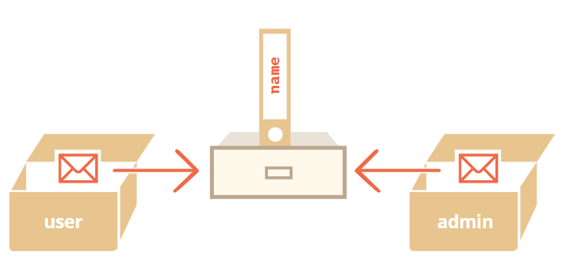

# 3.객체: 기본

## 🔮 이건 꼭 기억해야해!
- 없음

## 🧐면접관처럼 질문할 목록
- 없음

## 👻 공부하면서 어렵거나 중요한 개념 정리
## 1. 객체형(Object Type)
### 객체형 vs 원시형
- [원시형 타입](https://github.com/We-will-know-JS/JS-TIL/tree/main/part1/01.first-steps/joylish#1216-1%EC%9D%BC%EC%B0%A8)
- 객체형 타입: 키로 구분된 데이터 집합이나 복잡한 개체(entity)
> 중괄호{} 안에는 'key: value' 쌍으로 구성된 <b>프로퍼티</b>가 들어간다. key엔 only 문자형, value엔 모든 자료형 가능하다. 객체 프로퍼티엔 이런 제약이 없다.

<br/>
<b>❓ 객체 리터럴(object literal)</b>

중괄호 {...}를 이용해 객체를 선언하는 것 

<br/>
<b>💥 상수 객체는 수정될 수 있다! </b>

```javascript
const something = {
  name: "strawberry"
};

something.name = "grape";
```

const는 user의 값을 고정하지만, <u>그 내용을 고정하지 않는다!</u>

`const something = {value: 1000}` 이런식으로 새로운 객체 리터럴을 할당해주려고 할 때 오류가 발생한다.

<br/>
<b>💥 계산된 프로퍼티 (Computed property)  </b>

```javascript
let fruit = prompt("어떤 과일을 구매하시겠습니까?");
// strawberry

let bag = {
  [fruit]: 5,
};

alert(bag.strawberry);
```

<br/>
<b>💥 프로퍼티 존재 여부 확인 </b>

- `obj.key이름 === undefined`
  🤔 해당 key에 value가 할당되지 않으면 프로퍼티에 대한 존재 유무를 확인하기 힘들다. 
- `"key이름" in object`

<br/>
<b>💥 <u>정수 프로퍼티</u>를 이용하여 객체 정렬 </b>

```javascript
let codes = {
  "49": "독일",
  "41": "스위스",
  "44": "영국",
  // ..,
  "1": "미국"
};

for (let code in codes) {
  alert(code); // 1, 41, 44, 49
}
```
49(독일 나라 번호)를 가장 위에 출력되도록 하려면, 나라 번호가 정수로 취급되지 않도록 속임수를 쓰면 된다. 각 나라 번호 앞에 "+"를 붙이면 된다.

```javascript
let codes = {
  "+49": "독일",
  "+41": "스위스",
  "+44": "영국",
  // ..,
  "+1": "미국"
};

for (let code in codes) {
  alert( +code ); // 49, 41, 44, 1
}
```

## 2. 참조에 의한 객체 복사
<br/>

객체가 할당된 변수를 복사하면 동일한 객체에 대한 참조 값이 하나 더 만들어진다.


<br/>

```javascript
let user = { name: 'John' };

let admin = user;

admin.name = 'Pete';

console.log(user.name);
// Pete
console.log(admin.name);
// Pete
```

<br/>


### 💫 참조에 의한 비교

```javascript
let ball1 = {
  color: "blue",
}

let ball2 = ball1

let ball3 = = {
  color: "blue",
}

console.log(ball1 == ball2)
// true
console.log(ball1 == ball3)
// false
```

💥 객체끼리 비교(>, <, ==) 또는 원시값과 객체 비교할 경우 객체가 원시형으로 변환된다.

<br/>


### 💫 그럼 어떻게 객체를 복사할 수 있을까?
<br/>

1. 반복문으로 기존 객체 프로퍼티들을 순회
2. Object.assign 함수

    동일한 이름을 가진 프로퍼티가 있는 경우엔 기존 값 덮어짐

```javascript
let ball = {
  color: "blue",
};
let props1 = {
  size: "small",
};
let props2 = {
  name: "soccer",
};
let props3 = {
  color: "white",
};

Object.assign(ball, props1, props2);
console.log(ball)
// { color: "white", size: "small", name: "soccer"}
```

3. _.cloneDeep(obj)를 통해서 중첩객체 복사 

<br/>

## 3. 가비지 컬렉션

도달 가능성을 통해서 메모리가 관리된다.

## 4. this
|구분|함수|화살표함수|
|---|---|---|
this|함수 내 변수, 객체 접근 가능|화살표 함수가 아닌 외부 함수/컨텍스트에 접근 가능 